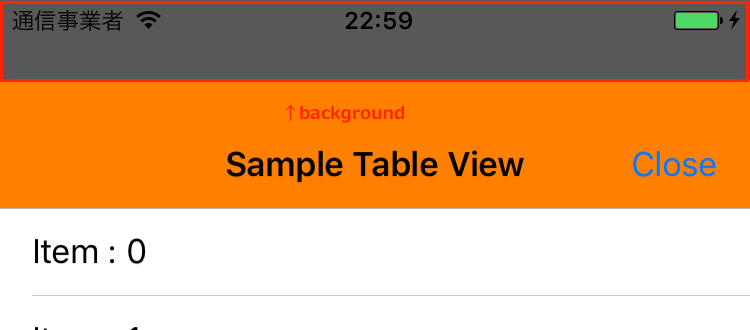
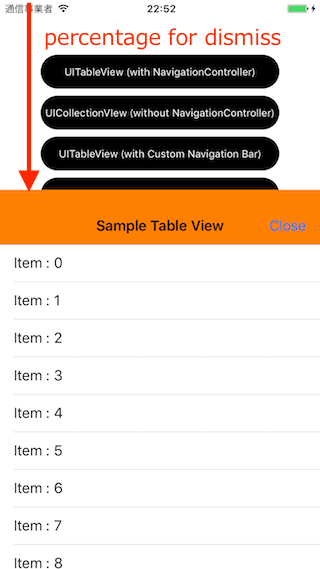

# PullToDismiss
Dismiss ViewController by pulling scroll view or navigation bar in Swift.

[](https://github.com/sgr-ksmt/PullToDismiss/releases)

[](https://github.com/Carthage/Carthage)
[](https://cocoapods.org)

|            sample            |            blur sample            |
|:----------------------------:|:---------------------------------:|
|  |  |


- [Appetize.io Demo](https://appetize.io/app/hett44vca458r9artkbq0awxrc?device=iphone7&scale=75&orientation=portrait&osVersion=10.0)

## Feature
- Easy to use!
- Support all scroll views. (UIScrollView, UITableView, UICollectionView)
- Customizable. (dismiss background color, alpha, height percentage of dismiss)
- Available in UIViewController, UINavigationController.
- Automatically add pan gesture to navigation bar.
- Blur effect support.

## Usage
### Getting Started
(1) Setup `PullToDismiss`

```swift
import PullToDismiss

class SampleViewController: UIViewController {
    @IBOutlet private weak var tableView: UITableView!
    private var pullToDismiss: PullToDismiss?
    override func viewDidLoad() {
        super.viewDidLoad()
        pullToDismiss = PullToDismiss(scrollView: tableView)
    }
}
```

(2) Create view controller and set `modalPresentationStyle`. Then present view controller

```swift
let vc = SampleViewController()
let nav = UINavigationController(rootViewController: vc)
nav.modalPresentationStyle = .overCurrentContext

self.present(nav, animated: true, completion: nil)
```

<br />
:thumbsup::thumbsup::thumbsup:

### Use `(UIScrollView|UITableView|UICollectionView)Delegate`

If you want to use delegate, set `delegateProxy`.

```swift
import PullToDismiss

class SampleViewController: UIViewController {
    @IBOutlet private weak var tableView: UITableView!
    private var pullToDismiss: PullToDismiss?
    override func viewDidLoad() {
        super.viewDidLoad()
        pullToDismiss = PullToDismiss(scrollView: tableView)
        pullToDismiss.delegateProxy = self
    }
}

extension SampleViewController: UITableViewDelegate {
    // called by PullToDismiss
    func scrollViewDidScroll(_ scrollView: UIScrollView) {
        // ...
    }

    // called by PullToDismiss
    func tableView(_ tableView: UITableView, didSelectRowAt indexPath: IndexPath) {
        // ...
    }
}
```

#### Advanced
PullToDismiss defines major `UIScrollView|UITableView|UICollectionViewDelegate` methods.  
But some delegate method aren't defined.  
If you want to use other methods, override PullToDismiss and define delegate method you want to.

```swift
import PullToDismiss

class CustomPullToDismiss: PullToDismiss {
    func tableView(_ tableView: UITableView, heightForRowAt indexPath: IndexPath) -> CGFloat {
        return tableViewDelegate?.tableView?(tableView, heightForRowAt: indexPath) ?? 44.0
    }
}

class SampleViewController: UIViewController {
    @IBOutlet private weak var tableView: UITableView!
    private var pullToDismiss: PullToDismiss?
    override func viewDidLoad() {
        super.viewDidLoad()
        pullToDismiss = CustomPullToDismiss(scrollView: tableView)
        pullToDismiss.delegateProxy = self
    }
}

extension SampleViewController: UITableViewDelegate {
    // called by CustomPullToDismiss
    func tableView(_ tableView: UITableView, heightForRowAt indexPath: IndexPath) -> CGFloat {
        return indexPath.section == 0 ? 44.0 : 60.0
    }

    // ...
}

```

### Customize
You can customize backgroundEffect, dismissableHeightPercentage:

#### Shadow background effet

- background (default: `ShadowEffect.default`, [color: black, alpha: 0.8])



```swift
pullToDismiss?.background = ShadowEffect(color: .red, alpha: 0.5) // color: red, alpha: 0.5
```

#### Blur background effect
New feature for v1.0.


```swift
// preset blur (.extraLight, .light, .dark)
pullToDismiss?.background = BlurEffect.extraLight

// set custom Blur
pullToDismiss?.background = BlurEffect(color: .red, alpha: 0.5, blurRadius: 40.0, saturationDeltaFactor: 1.8)
```

#### dismissableHeightPercentage




```swift
// to pull half size of view controller, dismiss view controller.
pullToDismiss?.dismissableHeightPercentage = 0.5
```


## Requirements
- iOS 8.0+ (blur effect: iOS 9.0+)
- Xcode 8.1+
- Swift 3.0+

## Installation

### Carthage

- Add the following to your *Cartfile*:

```bash
github 'sgr-ksmt/PullToDismiss' ~> 1.0
```

- Run `carthage update`
- Add the framework as described.
<br> Details: [Carthage Readme](https://github.com/Carthage/Carthage#adding-frameworks-to-an-application)


### CocoaPods

**PullToDismiss** is available through [CocoaPods](http://cocoapods.org). To install
it, simply add the following line to your Podfile:

```ruby
pod 'PullToDismiss' ~> 1.0
```

and run `pod install`

### Manually Install
Download all `*.swift` files and put your project.

## Communication
- If you found a bug, open an issue.
- If you have a feature request, open an issue.
- If you want to contribute, submit a pull request.:muscle:

## License

**PullToDismiss** is under MIT license. See the [LICENSE](LICENSE) file for more info.
